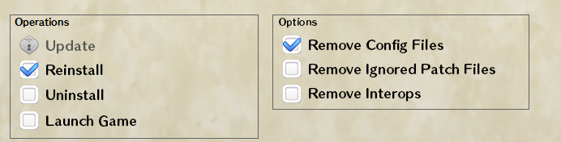
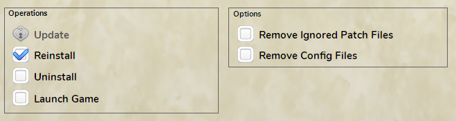

#  PriconneReTL Installer
An installer/updater GUI for the [PriconneRe-TL](https://github.com/ImaterialC/PriconneRe-TL) english patch.  
Make installing, updating and removing the unofficial english patch for Princess Connect Re:Dive japanese version easier.

Based on [PriconneTL_Updater](https://github.com/touanu/PriconeTL_Updater) by [touanu](https://github.com/touanu)

## You can download the latest version here:  
https://github.com/tynave/PriconneReTL-Installer/releases/latest

## Wiki
Refer to the [wiki](https://github.com/tynave/PriconneReTL-Installer/wiki) for more information on usage.

## Important notice for updating the translation patch after the latest annual Unity update  
After the annual Unity engine update that happened in Apr. 2024, the translation patch framework received breaking changes, which requires to <ins>**do a full reinstallation of the translation patch when trying to update from the version 20240430a and earlier.**</ins>  

You can achieve this using this installer in the following way:  

**Installer version 1.4.0 and earlier**  
Select the "Reinstall" operation and select the "Remove Config Files" option.  
Optionally you can select the "Remove Ignored Patch Files", but not necessary.  

**Installer version 1.5.0 or later**  
Select the "Reinstall" operation. You do not have to select any extra options, but you can, if you prefer.  

